# Subindo o RabbitMQ

Esse repositório foi criado para subir um rabbitMQ para atender o desenvolvimento do projeto da última fase da pós graduação em arquitetura de software pela FIAP, 06/2025-06/2026.

Para entender as especificações e requisitos funcionais e não funcionais do projeto, considere ler o [documento entregue aos alunos](./hackaton-soat.pdf).

A arquitetura montada para atender o MVP:



Observe que no [docker-compose.yaml](./docker-compose.yaml) a rede default é externa, o que significa que essa rede deve existir antes que você tente subir o serviço do rabbit:

```yaml
networks:
  default:
    name: soat-net
    external: true
```

Para criar essa rede, execute o seguinte comando na sua CLI com acesso ao Docker:
```sh
docker network create soat-net
```
Observe ainda no [docker-compose.yaml](./docker-compose.yaml) que as variáveis de ambiente não são definidas diretamente no arquivo, mas sim lidas de um arquivo `.env`.
```yaml
env_file:
    - .env
```

copie o `.env.example` para `.env`, defina usuário e senha de sua preferência ou mantenha os valores atuais.

Feito isso, tente:
```sh
docker-compose up -d --build
```

Se tudo deu certo, ao rodar `docker ps` você pode ver algo parecido com isso:
```sh
CONTAINER ID   IMAGE                                   COMMAND                  CREATED          STATUS                 PORTS                                                                                                                                                     NAMES
6481f270309f   rabbitmq:4.3.0-rc.0-management-alpine   "docker-entrypoint.s…"   12 minutes ago   Up 12 minutes          4369/tcp, 5671/tcp, 0.0.0.0:5672->5672/tcp, [::]:5672->5672/tcp, 15671/tcp, 15691-15692/tcp, 25672/tcp, 0.0.0.0:15672->15672/tcp, [::]:15672->15672/tcp   rabbit_mq
```

Acesse `http://127.0.0.1:15672/#/` e tente fazer login com o usuário e senha definidos no seu `.env`
