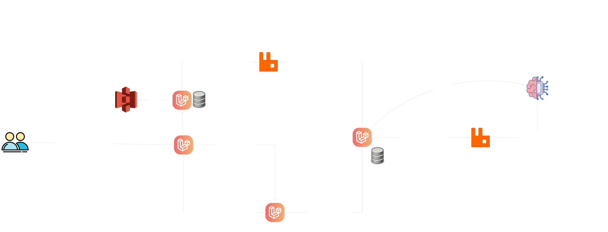

# Subindo o RabbitMQ

Esse repositório foi criado para subir um rabbitMQ para atender o desenvolvimento do projeto da última fase da pós graduação em arquitetura de software pela FIAP, 06/2025-06/2026.

Para entender as especificações e requisitos funcionais e não funcionais do projeto, considere ler o [documento entregue aos alunos](./hackaton-soat.pdf).

## Alunos

| Aluno | RM | Discord | LinkedIn |
|---|---|---|---|
| Felipe | 365154 | felipeoli7eira | [@felipeoli7eira](https://www.linkedin.com/in/felipeoli7eira) |
| Nicolas | 365746 | nic_hcm | [@Nicolas Martins](https://www.linkedin.com/in/nicolas-hcm) |
| William | 365973 | wllsistemas | [@William Francisco Leite](https://www.linkedin.com/in/williamfranciscoleite) |

## Descrição do Problema

O sistema tem como objetivo automatizar a análise de diagramas de arquitetura de software por meio de Inteligência Artificial. Equipes de engenharia submetem diagramas (JPG, JPEG, PNG ou PDF) e recebem, de forma assíncrona, um relatório com **componentes identificados**, **riscos** e **recomendações** de melhoria — eliminando a necessidade de revisão manual.

---

## Arquitetura Proposta

O sistema é composto por cinco microsserviços interligados:

| Serviço | Papel |
|---|---|
| **BFF** | Ponto de entrada unificado; orquestra chamadas aos serviços internos |
| **upload-service** | Recebe diagramas, armazena no Amazon S3, publica na fila `protocols` |
| **trigger-service** | Consome a fila, aciona a IA e persiste resultados no PostgreSQL |
| **report-service** | Consulta resultados e gera relatório em PDF |
| **RabbitMQ** *(este serviço)* | Broker de mensagens para comunicação assíncrona entre os serviços |



> Diagrama interativo: [FIAP - HACKATON FASE 5](https://www.tldraw.com/f/CPYtIC_xwtcfbSCH4vgkT?d=v567.4.3513.1667.page)

---

## Fluxo da Solução

**Envio para análise:**
1. Usuário envia diagrama via `POST /api/upload` no BFF
2. BFF repassa ao **upload-service**, que armazena no Amazon S3
3. **upload-service** publica `{ protocol_uuid, file_url, ... }` na fila `protocols` do RabbitMQ
4. **trigger-service** consome a mensagem e aciona o **Analysis Service (IA)**
5. IA processa e publica o resultado na fila `analysis_response`
6. **trigger-service** persiste o resultado no PostgreSQL (`SUCESSO` ou `ERRO`)

**Consulta do resultado:**
1. Usuário consulta status via `GET /api/status/{uuid}` no BFF
2. Usuário solicita relatório via `GET /api/report/{uuid}` no BFF
3. **report-service** busca os dados no **trigger-service** e gera o PDF

---

## Instruções de Execução

Observe que no [docker-compose.yaml](./docker-compose.yaml) a rede default é externa, o que significa que essa rede deve existir antes que você tente subir o serviço do rabbit:

```yaml
networks:
  default:
    name: soat-net
    external: true
```

Para criar essa rede, execute o seguinte comando na sua CLI com acesso ao Docker:
```sh
docker network create soat-net
```
Observe ainda no [docker-compose.yaml](./docker-compose.yaml) que as variáveis de ambiente não são definidas diretamente no arquivo, mas sim lidas de um arquivo `.env`.
```yaml
env_file:
    - .env
```

copie o `.env.example` para `.env`, defina usuário e senha de sua preferência ou mantenha os valores atuais.

Feito isso, tente:
```sh
docker-compose up -d --build
```

Se tudo deu certo, ao rodar `docker ps` você pode ver algo parecido com isso:
```sh
CONTAINER ID   IMAGE                                   COMMAND                  CREATED          STATUS                 PORTS                                                                                                                                                     NAMES
6481f270309f   rabbitmq:4.3.0-rc.0-management-alpine   "docker-entrypoint.s…"   12 minutes ago   Up 12 minutes          4369/tcp, 5671/tcp, 0.0.0.0:5672->5672/tcp, [::]:5672->5672/tcp, 15671/tcp, 15691-15692/tcp, 25672/tcp, 0.0.0.0:15672->15672/tcp, [::]:15672->15672/tcp   rabbit_mq
```

Acesse `http://127.0.0.1:15672/#/` e tente fazer login com o usuário e senha definidos no seu `.env`
